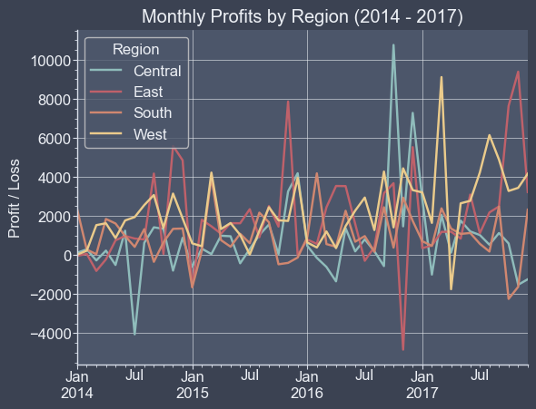
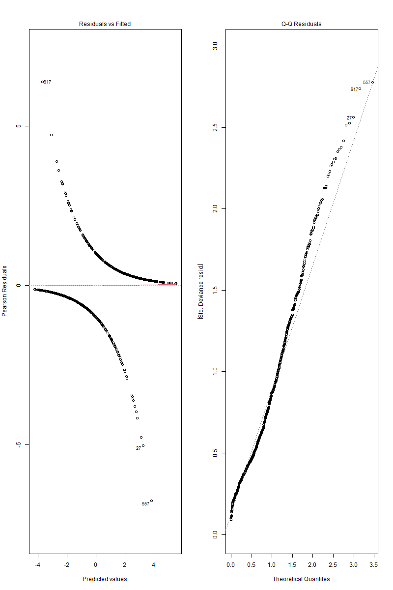
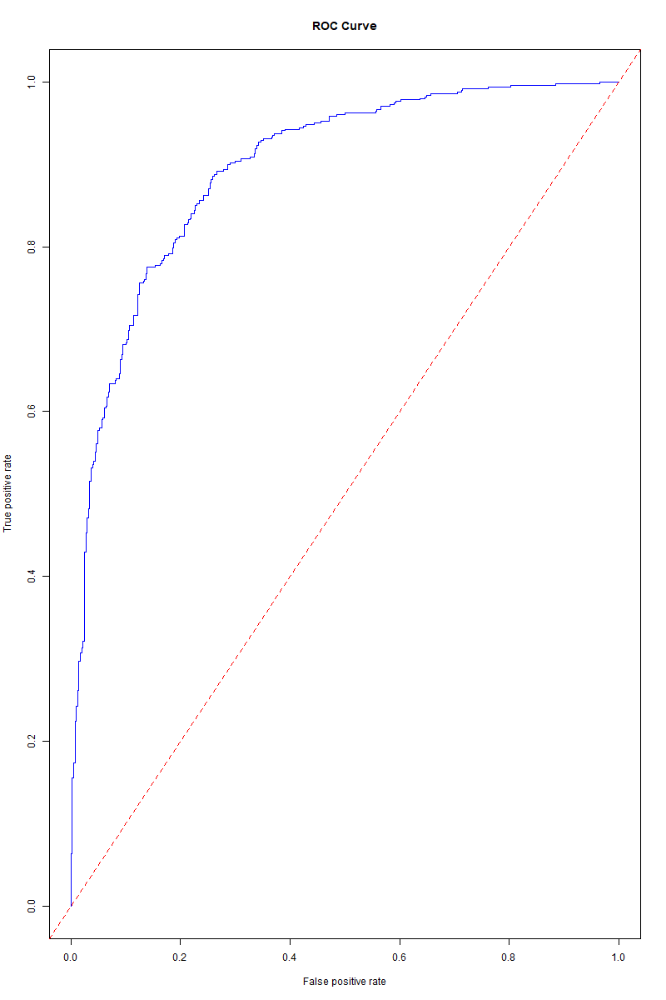
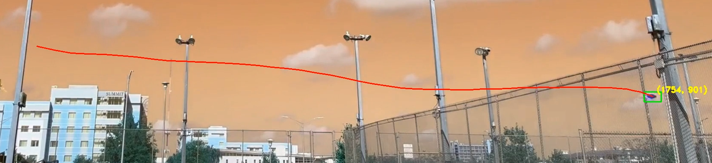
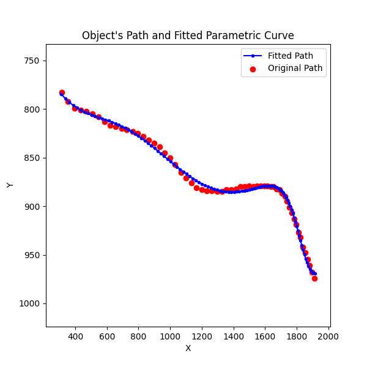
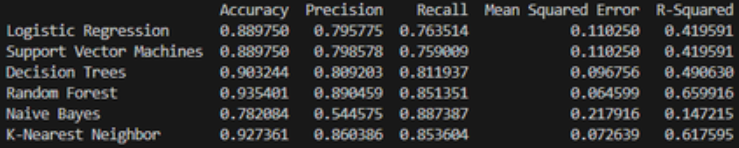

## Key Skills
- **Python / Jupyter Notebook** (Pandas, NumPy, MatPlotLib)
- **R** (ggplot, tidyverse, caret)
- **SQL** (mySQL)
- **Excel** (VLookup, Pivot Table)
- **Tableau**
- **Microsoft Power BI**
- **Jupyter Notebook**
- **Microsoft Word and Powerpoint**

## Projects
[**Project 1: Superstore Analysis**](link soon)
- Used **python** to import, clean, and transform a dataset with **Pandas**.
- **Pivot tables** were made to understand the distribution of the data.
- Visualizations for several metrics like profits, products sold, and discounts were created with **MatPlotLib**.
- Created a **mySQL** database with several tables to store the data.

-----
[**Project 2: Patient Heart Disease Classification**](link soon)
- Used **R** to create a **binary classification model** based on patient demographics and health data.
- Data cleaning and transformation were done and the data was split into training and testing data using **tidyverse**.
- The **logistic model** was created and optimized by minimizing AIC using **MASS**.
- Chi square test of independence, 10-fold cross validation, confusion matrix, and other visualizations were made to determine the quality of the model with **ggplot, caret, and ROCR**.

-----
[**Project 3: Tracking Paper Airplanes**](link soon)
- Was the main programmer in a group project and used **python** to draw a bounding box around the paper airplane and track it's trajectory over several throws.
- The bounding box and trajectory line were drawn onto a new video and exported using **MoviePy** and **os**.
- Parametric equations for the path were fit to the resulting points and scaled appropriately using **NumPy**.
- Based on the parametric equations, other motion calculations were made and visualizations were created using **MatPlotLib**.
- The paths were compared to a MATLAB simulation created by Robert F. Stengel and assessed for accuracy.

-----
[**Project 4: Miami Housing Market Classification**](https://github.com/BradleyGenereux/STA_4103_Project1)
- Was the main programmer in a group project and used **python** to create several models for the affordability of housing in Miami.
- Explanatory variables included area, latitude and longitude, distance from the ocean, distance from a highway, and more.
- **Logistic regression**, **support vector machines**, **decision trees**, **random forest**, **naive bayes**, and **k-nearest neighbors** models were compared with **sklearn**.
- The accuracy, precision, recall, mean squared error, and r-squared values for each model were calculated.

## Education
**University of South Florida** (2019 - 2025): **3.35 GPA**  
B.S. Mathematics: Computational and Applied  
    - Concentration in Data Analysis and Business Intelligence  
Computer Science Minor
